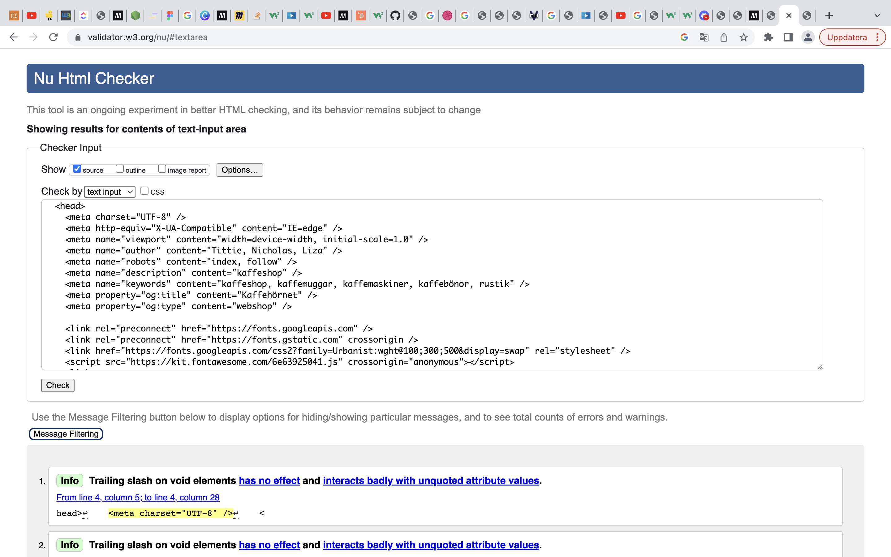
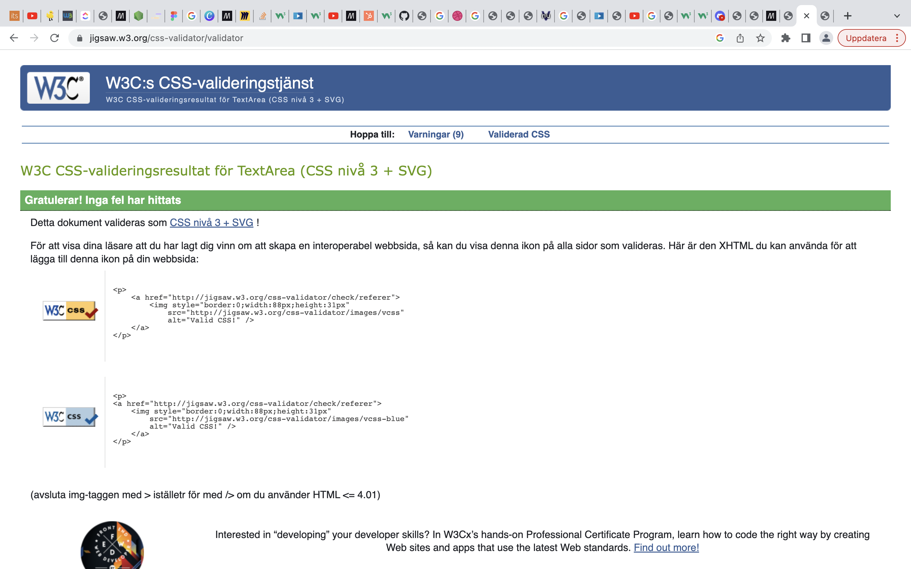
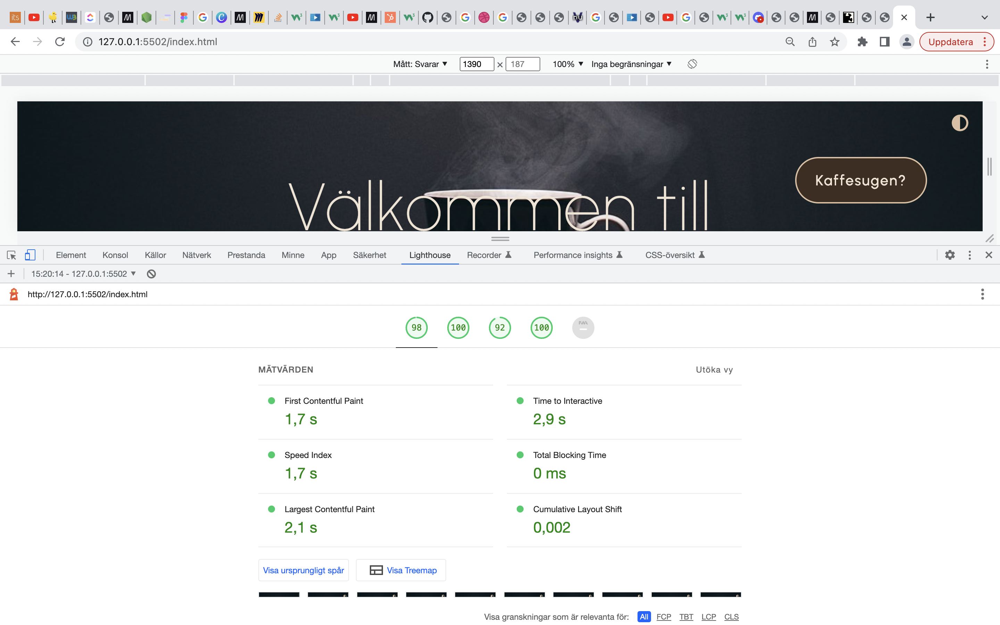
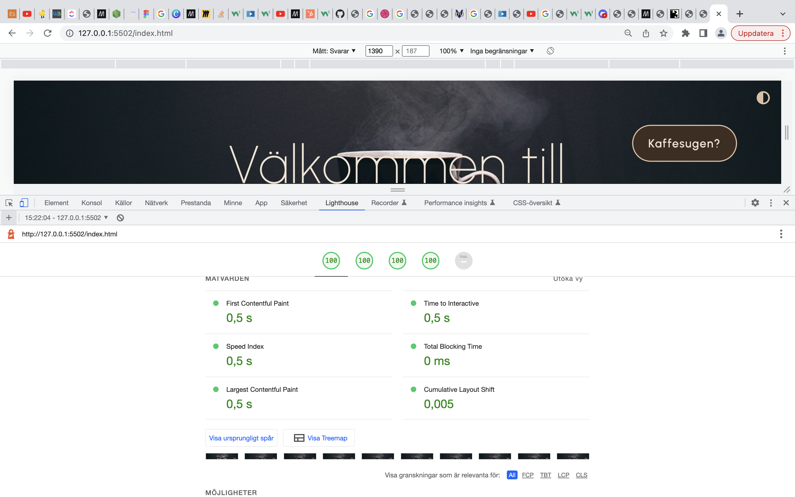

<!--  -->

<h1> Välkommen till KaffeHörnet </h1>

<strong>
Ett projekt av Nicholas Peters, Tittie Thomasson och Liza Grapensparr
</strong>

<small><a href="https://medieinstitutet.github.io/fed22d-js-grundkurs-gruppuppgift-webbshop-superfantasticultratrio/">
Länk till live-sidan </a></small>

Detta är ett grupparbete i kursen: JavaScript Grundkurs. 
Målet var att skapa en webshop som är (nästan) helt funktionell. Förutom den vikigaste biten då... Varorna leveras alltså aldrig.

<h2> Teknikstack </h2>

HTML, CSS, JavaScript, Sass, ESLint, Prettier.  
GitHub för versionshantering

<h2> Skärmdumpar </h2>

<h2> Valideringsrapporter </h2>

Här fick vi en massa info-meddelande om att vi inte behöver / i självstängande taggar. Något vi behöver skriva in i ES-lint

<h2> Lighthouserapporter </h2>

För mobil

För dator

